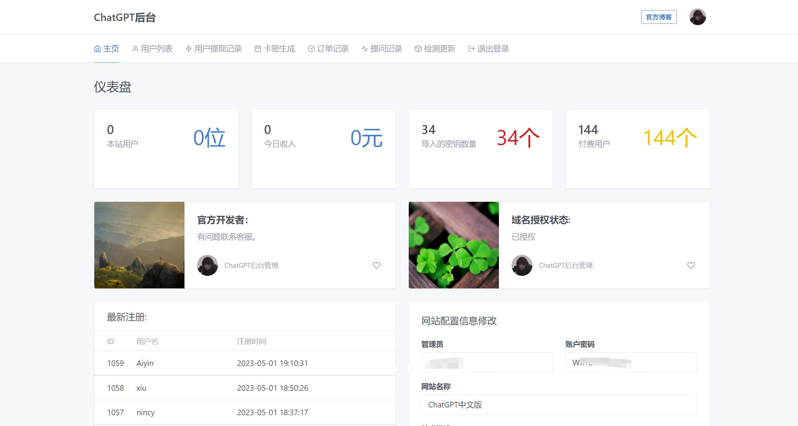
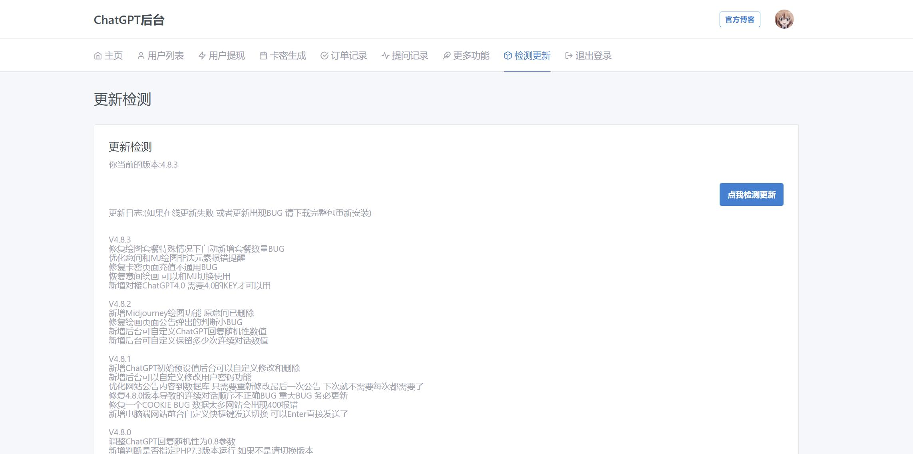

# chatgpt-web
ChatGPT商业版，支持AI绘画、卡密兑换、KEY轮询、用户试用（可任意配置）、用户推广等强大功能

## 联系

Q群2：159740513

## 功能

- [x] 登录、注册、用户管理

- [x] 用户试用（可任意配置，给客户试用机会，用过才说好）

- [x] 用户自推广（让用户去推广咱们的ChatGPT，省去拓客烦恼）

- [x] 服务端保存用户聊天记录

- [x] AI绘画（更加强大的Mj）

- [x] key 轮询池

- [x] 用户额度管理

- [x] 自定义回复内容

- [x] 自定义敏感词

- [x] 详细安装教程，完善售后

- [ ] 更多..

## 预览

### 前台

#### 问答页面

#### 绘画

#### 购买套餐

#### 客户自推广（可任意配置）

### 后台

#### 后台首页

#### 卡密

#### 提问记录

#### 绘画配置

#### 轮询Key

#### 更新日志

#### 更多设置

## 安装

### 准备

一台服务器（最好是国外的）、宝塔面板、域名一个

1、创建站点，PHP版本选择:7.3

2、解析域名

3、上传程序至根目录

4、使用宝塔创建chatgpt数据库，编码使用utf8mb4

5、访问网站首页在线安装配置数据库

配置完成后访问网站首页即可！

**一定要在网站后台首页配置APIKEY，登录网站后台自定义配置，不然网站无法使用！** 

**网站后台地址/admin 默认账号:admin 密码:123456**